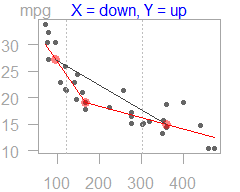

<!-- README.md is generated from README.Rmd. Please edit that file -->

# tukeyedar

<!-- badges: start -->

[](https://github.com/mgimond/tukeyedar/actions/workflows/check-release.yaml)

[](https://lifecycle.r-lib.org/articles/stages.html#experimental)
<!-- badges: end -->

The `tukeyedar` package houses a subset of functions used in Exploratory
Data Analysis (EDA). Most functions are inspired by work published by
Tukey (1977), D. C. Hoaglin and Tukey (1983) and Velleman and Hoaglin
(1981). Note that this package is in beta mode, so use at your own
discretion. Many of the plots generated from these functions are not
necessarily geared for publication but are designed to focus the
viewer’s attention on the patterns generated by the plots (hence the
reason for light colored axes and missing axes labels for some of the
plots ).

## Installation

You can install the development version of tukeyedar from
[GitHub](https://github.com/) with:

``` r
# install.packages("devtools")
devtools::install_github("mgimond/tukeyedar")
```

Note that the vignettes will not be automatically generated with the
above command; note too that the vignettes are available on this website
(see next section). If you want a local version of the vignettes, add
the `build_vignettes = TRUE` parameter.

``` r
devtools::install_github("mgimond/tukeyedar", build_vignettes = TRUE)
```

The vignette will require that `dplyr` be installed since the `eda_sl`
function relies on it. If `dplyr` is not already installed, the
aforementioned syntax will automatically install it for you.

If for some reason the vignettes are not created, you might want to
re-install the package with the `force=TRUE` parameter.

``` r
devtools::install_github("mgimond/tukeyedar", build_vignettes = TRUE, force=TRUE)
```

## Vignettes

It’s strongly recommended that you read the vignettes. These can be
accessed from this website:

- [A detailed rundown of the resistant line
  function](https://mgimond.github.io/tukeyedar/articles/RLine.html)
- [The median
  polish](https://mgimond.github.io/tukeyedar/articles/polish.html)

If you chose to have the vignettes locally created when you installed
the package, then you can view them locally via
`vignette("RLine", package = "tukeyedar")`. If you use a dark themed
IDE, the vignettes may not render very well so you might opt to view
them in a web browser via the functions
`RShowDoc("RLine", package = "tukeyedar")`.

## Using the functions

All functions start with `eda_`. For example, to generate a three point
summary plot of the `mpg` vs. `disp` from the `mtcars` dataset, type:

``` r
library(tukeyedar)
eda_3pt(mtcars, disp, mpg)
```



    #> $slope1
    #> [1] -0.1117241
    #> 
    #> $slope2
    #> [1] -0.0220894
    #> 
    #> $hsrtio
    #> [1] 0.1977137
    #> 
    #> $xmed
    #> [1]  95.1 167.6 360.0
    #> 
    #> $ymed
    #> [1] 27.30 19.20 14.95

Note that most functions are *pipe* friendly. For example, the following
works:

``` r
# Using R >= 4.1
mtcars |>  eda_3pt(disp, mpg)

# Using magrittr (or any of the tidyverse packages)
library(magrittr)
mtcars %>% eda_3pt(disp, mpg)
```

------------------------------------------------------------------------

<div id="refs" class="references csl-bib-body hanging-indent">

<div id="ref-understanding_eda1983" class="csl-entry">

D. C. Hoaglin, F. Mosteller, and J. W. Tukey. 1983. *Understanding
Robust and Exploratory Data Analysis*. Wiley.

</div>

<div id="ref-eda1977" class="csl-entry">

Tukey, John W. 1977. *Exploratory Data Analysis*. Addison-Wesley.

</div>

<div id="ref-applied_eda1981" class="csl-entry">

Velleman, P. F., and D. C. Hoaglin. 1981. *Applications, Basics and
Computing of Exploratory Data Analysis*. Boston: Duxbury Press.

</div>

</div>
