# Resistant Line

### The resistant line basics

The `eda_rline` function fits a robust line through a bivariate dataset.
It does so by first breaking the data into three roughly equal sized
batches following the x-axis variable. It then uses the batches’ median
values to compute the slope and intercept.

However, the function doesn’t stop there. After fitting the inital line,
the function fits another line (following the aforementioned
methodology) to the model’s residuals. If the slope is not close to
zero, the residual slope is added to the original fitted model creating
an *updated* model. This iteration is repeated until the residual slope
is close to zero or until the residual slope changes in sign (at which
point the average of the last two iterated slopes is used in the final
fit).

An example of the iteration follows using data from Velleman et. al’s
book. The dataset, `neoplasms`, consists of breast cancer mortality
rates for regions with varying mean annual temperatures.

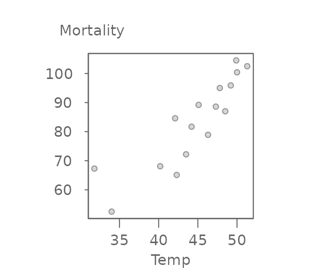

The three batches are divided as follows:

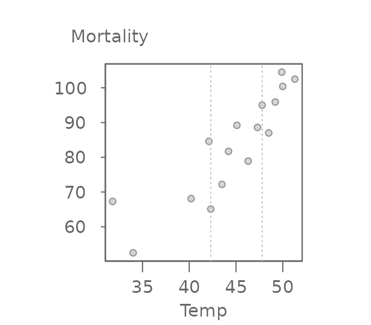

Note that the 16 record dataset is not divisible by three thus forcing
an extra point in the middle batch (had the remainder of the division by
three been two, then each extra point would have been added to the
tail-end batches).

Next, we compute the medians for each batch (highlighted as red points
in the following figure).

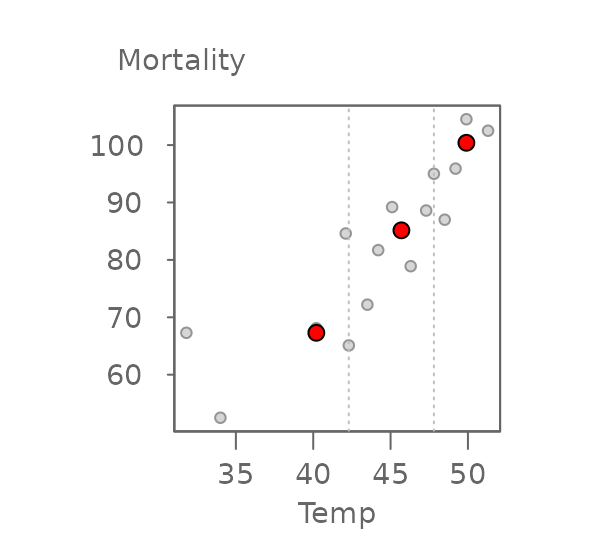

The two end medians are used to compute the slope as:

\\ b = \frac{y_r - y_l}{x_r-x_l} \\

where the subscripts \\r\\ and \\l\\ reference the median values for the
right-most and left-most batches.

Once the slope is computed, the intercept can be computed as follows:

\\ median(y\_{l,m,r} - b \* x\_{l,m,r}) \\

where \\(x,y)\_{l,m,r}\\ are the median x and y values for each batch.
This line is then used to compute the first set of residuals. A line is
then fitted to the residuals following the same procedure outlined
above.

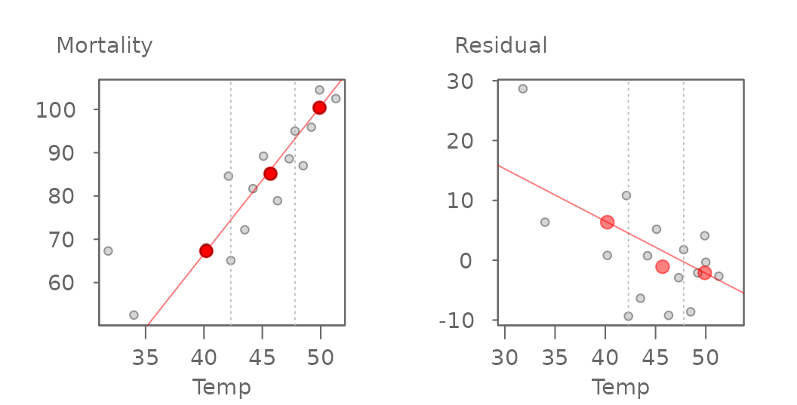

The initial model slope and intercept are 3.412 and -69.877 respectively
and the residual’s slope and intercept are -0.873 and 41.451
respectively. The residual slope is then added to the first computed
slope and the process is again repeated thus generating the following
tweaked slope and updated residuals:

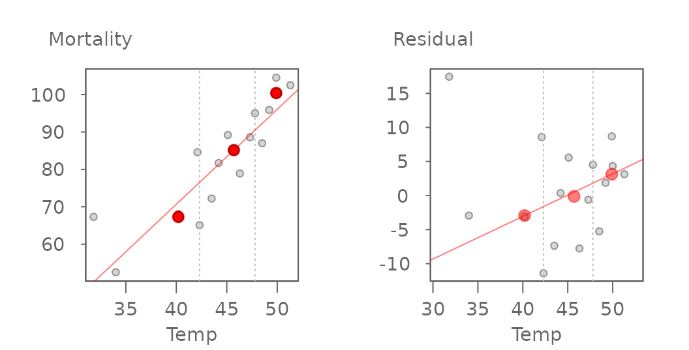

The updated slope is now 3.412 + (-0.873) = 2.539. The iteration
continues until the slope residuals stabilize. The final line for this
working example is,

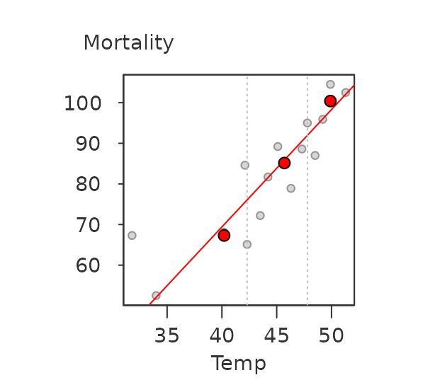

where the final slope and intercept are 2.89 and -46.2, respectively.

### Implementing the resistant line

The `eda_rline` takes just three arguments: data frame, x variable and y
variable. The function output is a list.

``` r

library(tukeyedar)
M <- eda_rline(neoplasms, Temp, Mortality)
```

``` r

M
#>  $data
#>     Temp Mortality    residuals
#>  1  31.8      67.3  21.59489403
#>  2  34.0      52.5   0.43651252
#>  3  40.2      68.1  -1.88256262
#>  4  42.1      84.6   9.12610790
#>  5  42.3      65.1 -10.95192678
#>  6  43.5      72.2  -7.32013487
#>  7  44.2      81.7   0.15674374
#>  8  45.1      89.2   5.05558767
#>  9  46.3      78.9  -8.71262042
#>  10 47.3      88.6  -1.90279383
#>  11 47.8      95.0   3.05211946
#>  12 48.5      87.0  -6.97100193
#>  13 49.2      95.9  -0.09412331
#>  14 49.9     104.5   6.48275530
#>  15 50.0     100.4   2.09373796
#>  16 51.3     102.5   0.43651252
#>  
#>  $b
#>  [1] 2.890173
#>  
#>  $a
#>  [1] -46.20241
#>  
#>  $residuals
#>   [1]  21.59489403   0.43651252  -1.88256262   9.12610790 -10.95192678
#>   [6]  -7.32013487   0.15674374   5.05558767  -8.71262042  -1.90279383
#>  [11]   3.05211946  -6.97100193  -0.09412331   6.48275530   2.09373796
#>  [16]   0.43651252
#>  
#>  $x
#>   [1] 31.8 34.0 40.2 42.1 42.3 43.5 44.2 45.1 46.3 47.3 47.8 48.5 49.2 49.9 50.0
#>  [16] 51.3
#>  
#>  $y
#>   [1]  67.3  52.5  68.1  84.6  65.1  72.2  81.7  89.2  78.9  88.6  95.0  87.0
#>  [13]  95.9 104.5 100.4 102.5
#>  
#>  $xmed
#>  [1] 40.2 45.7 49.9
#>  
#>  $ymed
#>  [1]  67.30  85.15 100.40
#>  
#>  $index
#>  [1]  5 11 16
#>  
#>  $xlab
#>  [1] "Temp"
#>  
#>  $ylab
#>  [1] "Mortality"
#>  
#>  $px
#>  [1] 1
#>  
#>  $py
#>  [1] 1
#>  
#>  $tukey
#>  [1] FALSE
#>  
#>  $base
#>  [1] 2.718282
#>  
#>  $iter
#>  [1] 4
#>  
#>  $fitted.values
#>   [1]  45.70511  52.06349  69.98256  75.47389  76.05193  79.52013  81.54326
#>   [8]  84.14441  87.61262  90.50279  91.94788  93.97100  95.99412  98.01724
#>  [15]  98.30626 102.06349
#>  
#>  attr(,"class")
#>  [1] "eda_rline"
```

The elements `a` and `b` are the model’s intercept and slope. The
vectors `x` and `y` are the input values sorted on `x`. `res` is a
vector of the final residuals sorted on `x`. `xmed` and `ymed` are
vectors of the medians for each of the three batches. `px` and `py` are
power transformations applied to the variables.

The output is a list of class `eda_rline`. A `plot` method is available
for this class.

``` r

plot(M)
```

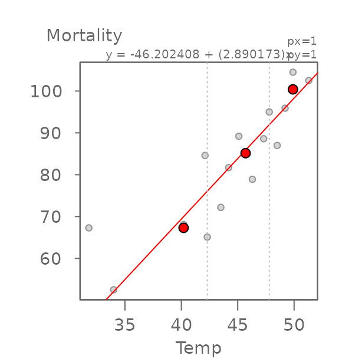

To see how this resistant line compares to an ordinary least-squares
(OLS) regression slope, add the output of the `lm` model to the plot via
the argument\`reg = TRUE\`\`:

``` r

plot(M, reg = TRUE)
```

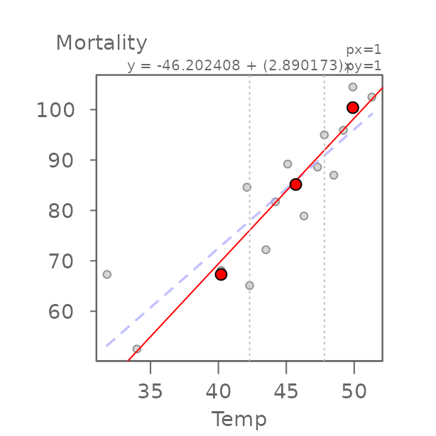

    #>         int     Temp^1 
    #>  -21.794691   2.357695

The regression model computes a slope of `2.36` whereas the resistant
line function generates a slope of `2.89`. From the scatter plot, we can
spot a point that may have undo influence on the regression line (this
point is highlighted in green in the following plot).

    #>         int     Temp^1 
    #>  -21.794691   2.357695
    points(neoplasms[15,], col="#43CD80",cex=1.5 ,pch=20)

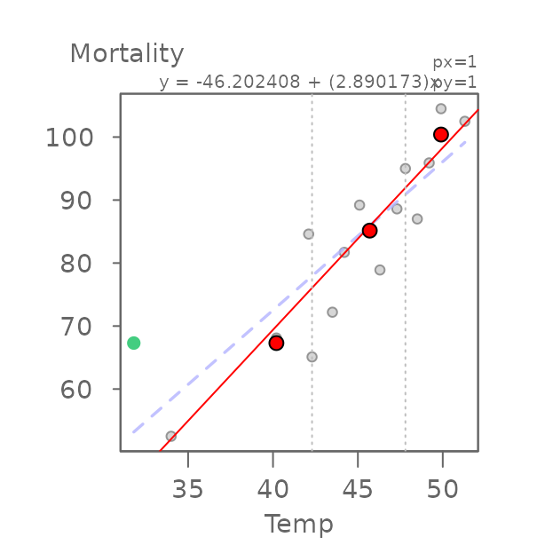

Removing that point from the data generates an OLS regression line more
inline with our resistant model. The point of interest is the 15^(th)
record in the `neoplasms` data frame.

``` r

neoplasms.sub <- neoplasms[-15,]
```

``` r

M.sub <- eda_rline(neoplasms.sub, Temp, Mortality)
plot(M.sub, reg = TRUE)
```

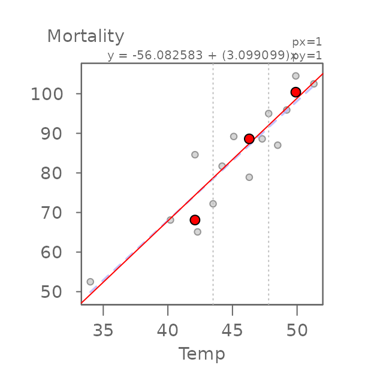

    #>         int     Temp^1 
    #>  -52.618107   3.015214

Note how the OLS slope is inline with that generated from the resistant
line. You’ll also note that the resistant line slope has also changed.
Despite the resistant nature of the line, the removal of this point
changed the makeup of the first tier of values (note the leftward shift
in the vertical dashed line). This changed the makeup of this batch thus
changing the median values for the first and second tier batches.

### Other examples

#### Nine point data

The `nine_point` dataset is used by Hoaglin et. al (p. 139) to test the
resistant line function’s ability to stabilize wild oscillations in the
computed slopes across iterations.

``` r

M <- eda_rline(nine_point, X,Y)
plot(M)
```

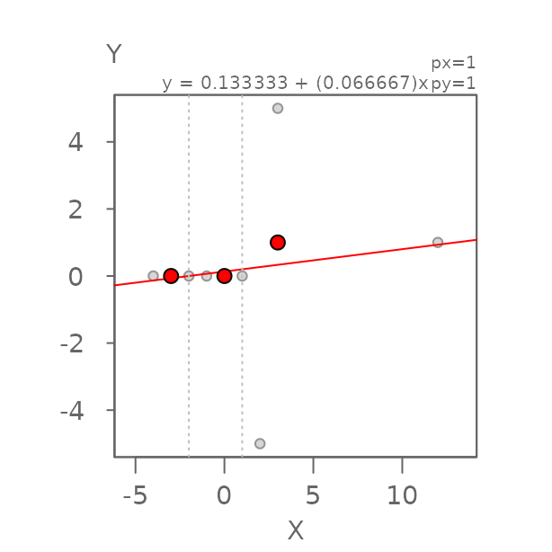

Here, slope and intercept are 0.067 and 0.133 respectively matching the
1/15 and 2/15 values computed by Hoaglin et. al.

#### Age vs. height data

`age_height` is another dataset found in Hoaglin et. al (p. 135). It
gives the ages and heights of children from a private urban school.

``` r

M <- eda_rline(age_height, Months,Height)
plot(M)
```

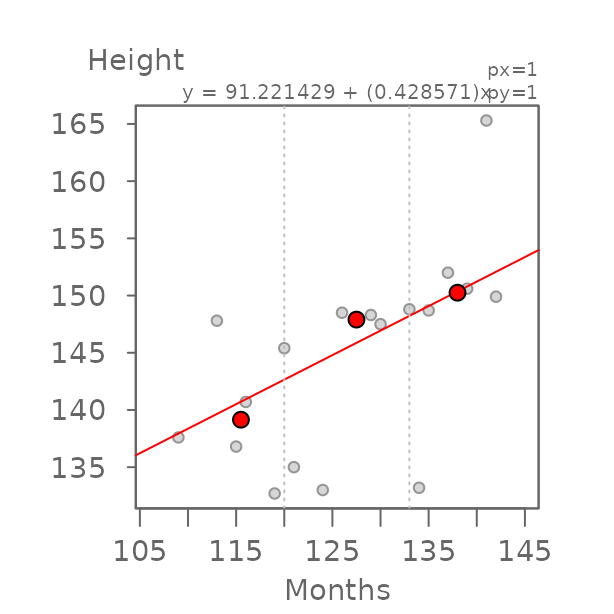

Here, slope and intercept are 0.429 and 91.221 respectively matching the
0.426 slope and closely matching the 90.366 intercept values computed by
Hoaglin et. al on page 137.

### Not all relationships are linear!

It’s important to remember that the resistant line technique is only
valid if the bivariate relationship is linear. Here, we’ll step through
the example highlighted by Velleman et. al (p. 138) using the R built-in
`mtcars` dataset.

First, we’ll fit the resistant line to the data.

``` r

M <- eda_rline(mtcars, disp, mpg)
plot(M)
```

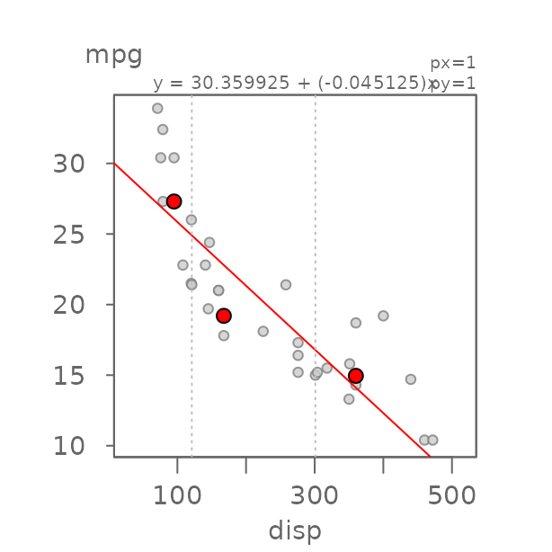

It’s important to note that just because a resistant line can be fit
does not necessarily imply that the relationship is linear. To assess
linearity of the `mtcars` dataset, we’ll make use of the `eda_3pt`
function.

``` r

eda_3pt(mtcars, disp, mpg)
```

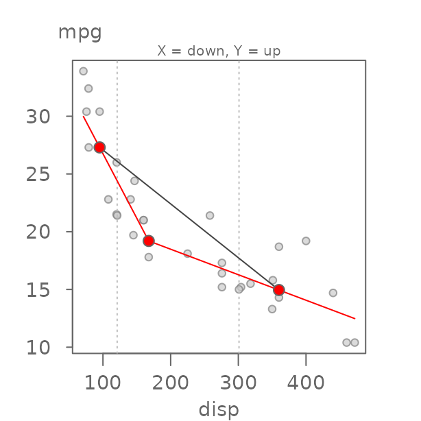

It’s clear from the two half slopes that the relationship is not linear.
Velleman et. al first suggest re-expressing `mpg` to `1/mpg`
(i.e. applying a power transformation of `-1`) giving us number of
gallons consumed per mile driven.

``` r

eda_3pt(mtcars, disp, mpg, py = -1, ylab = "gal/mi")
```

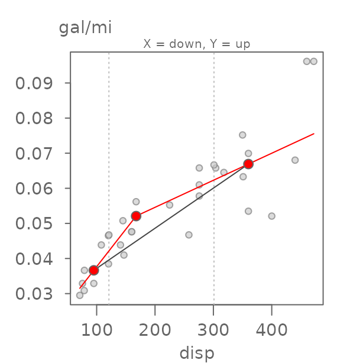

The two half slopes still differ. We will therefore opt to re-express
the `disp` variable. One possibility is to take the inverse of 1/3 since
displacement is a measure of volume (e.g. length³) which gives us:

``` r

eda_3pt(mtcars, disp, mpg,  px = -1/3, py = -1,
        ylab = "gal/mi", xlab = expression("Displacement"^{-1/3}))
```

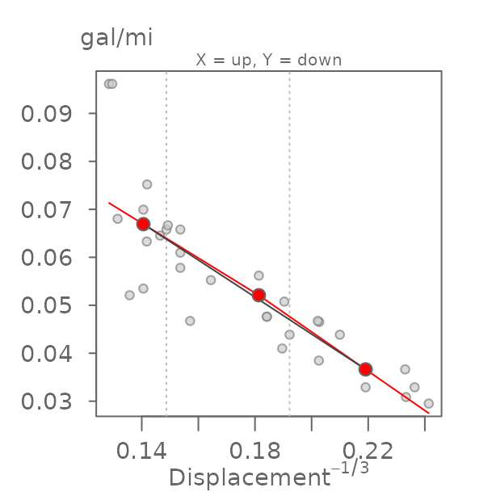

Now that we have identified re-expressions that linearises the
relationship, we can fit the resistant line. (Note that the grey line
generated by the `eda_3pt` function is not the same as the resistant
line generated with `eda_rline`.)

``` r

M <- eda_rline(mtcars, disp, mpg,  px = -1/3, py = -1)
plot(M, ylab = "gal/mi", xlab = expression("Displacement"^{-1/3}))
```

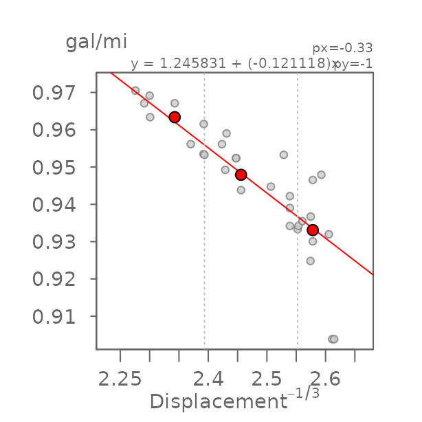

### Computing a confidence interval

Confidence intervals for the coefficients can be estimated using
bootstrapping techniques. There are two approaches: resampling residuals
and resampling x-y cases.

#### Resampling the model residuals

Here, we fit the resistant line then extract its residuals. We then
re-run the model many times by replacing the original y values with the
**modeled** y values **plus** the resampled residuals to generate the
confidence intervals.

``` r

n  <- 999 # Set number of iterations
M  <- eda_rline(neoplasms, Temp, Mortality) # Fit the resistant line
bt <- array(0, dim=c(n, 2)) # Create empty bootstrap array
for(i in 1:n){ #bootstrap loop
  df.bt <- data.frame(x=M$x, y = M$y +sample(M$res,replace=TRUE))
  bt[i,1] <- eda_rline(df.bt,x,y)$a
  bt[i,2] <- eda_rline(df.bt,x,y)$b
}
```

Now plot the distributions,

``` r

hist(bt[,1], main="Intercept distribution")
hist(bt[,2], main="Slope distribution")
```


and tabulate the 95% confidence interval.

``` r

conf <- t(data.frame(Intercept = quantile(bt[,1], p=c(0.05,0.95) ),
                     Slope = quantile(bt[,2], p=c(0.05,0.95) )))
conf
#>                    5%       95%
#>  Intercept -75.916394 13.180681
#>  Slope       1.643678  3.553286
```

#### Resampling the x-y paired values

Here, we resample the x-y paired values (with replacement) then compute
the resistant line each time.

``` r

n  <- 1999 # Set number of iterations
bt <- array(0, dim=c(n, 2)) # Create empty bootstrap array
for(i in 1:n){ #bootstrap loop
  recs <- sample(1:nrow(neoplasms), replace = TRUE)
  df.bt <- neoplasms[recs,]
  bt[i,1]=eda_rline(df.bt,Temp,Mortality)$a
  bt[i,2]=eda_rline(df.bt,Temp,Mortality)$b
}
```

Now plot the distributions,

``` r

hist(bt[,1], main="Intercept distribution")
hist(bt[,2], main="Slope distribution")
```


and tabulate the 95% confidence interval.

``` r

conf <- t(data.frame(Intercept = quantile(bt[,1], p=c(0.05,0.95) ),
                     Slope = quantile(bt[,2], p=c(0.05,0.95) )))
conf
#>                    5%       95%
#>  Intercept -110.38963 13.187096
#>  Slope        1.64348  4.183534
```

## References

- *Applications, Basics and Computing of Exploratory Data Analysis*,
  P.F. Velleman and D.C. Hoaglin, 1981.  
- *Understanding robust and exploratory data analysis*, D.C. Hoaglin, F.
  Mosteller and J.W. Tukey, 1983.
