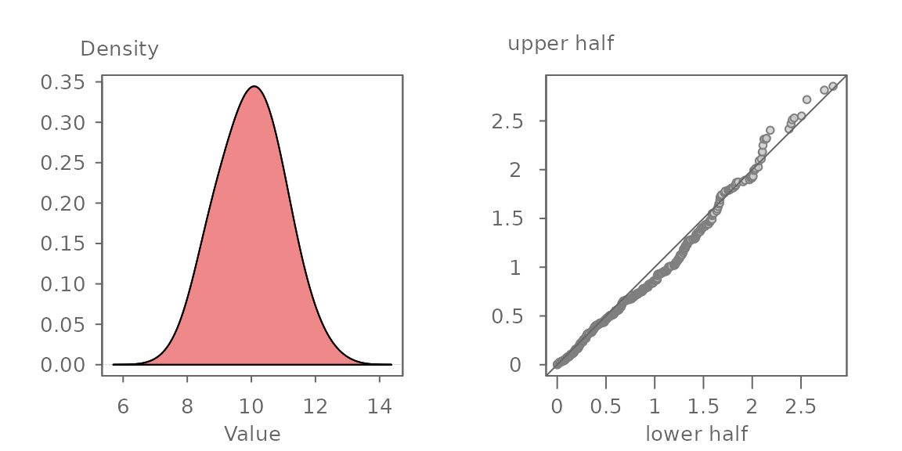
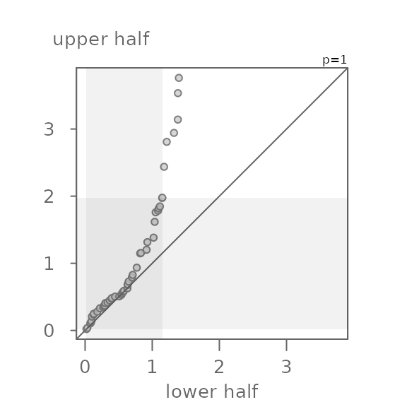
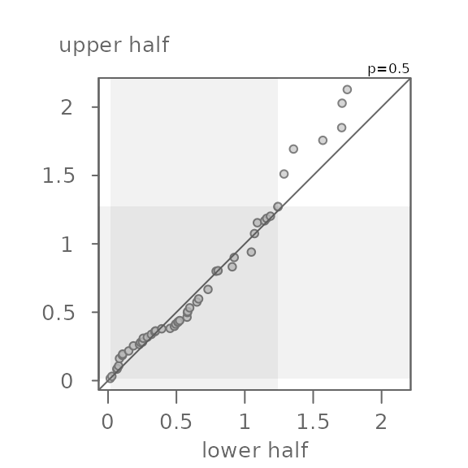
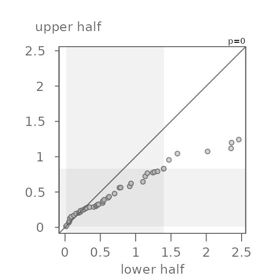

# The symmetry QQ plot

## Introduction

The symmetry QQ plot is inspired by Chambers *et al.*’s **symmetry
plot** which pairs the quantiles of the lower half of a batch of values
with matching quantiles of the batch’s upper half of values. The median
value is used to define the halves as follows:

\\ lower\\ half = median - x_i \\

\\ upper\\ half = x\_{n+1-i} - median \\

where \\n\\ is the number of values in \\x\\, \\i\\ = 1 to \\n/2\\ if
\\n\\ is even or \\i\\ = 1 to \\(n+1)/2\\ if \\n\\ is odd.

The plot is interpreted no differently than a QQ plot. If the data are
symmetrical about the batch’s median value, the points will hug the
\\x=y\\ line. For example, given a batch of 1000 normally distributed
values shown in the left density plot, we would expect the symmetry QQ
plot to show the points very close to the \\x=y\\ line as shown in the
right plot.



The axes in the symmetry QQ plot show the distance of each observation
in the batch to that batch’s median value. The units are those of the
batch. Points that are close to 0 are those observations closest to the
median. Points that are furthest from 0 are those that are at both tail
ends of the distribution.

## The symmetry QQ plot function

The symmetry QQ plot is generated using the
[`eda_sym()`](https://mgimond.github.io/tukeyedar/reference/eda_sym.md)
function.

Before exploring the function and its output, let’s first generate some
data. Here, we’ll create a slightly skewed dataset (one that is skewed
towards larger values).

``` r

set.seed(123) 
x <- rgamma(100, shape = 2, scale = 1)  
```

Next, let’s generate the symmetry QQ plot.

``` r

library(tukeyedar)

eda_sym(x)
```



If you are familiar with the use of `eda_qq` as an empirical QQ plot
function, you are familiar with the grey boxes that highlight the mid
75% of the values. Here, given that the x and y axes are mapping the
lower and upper halves of the batch, the lower part of the grey region
is bounded by `0` given that `0` is defined as the batch’s mid-point.

In this example, the points do not hug the \\x=y\\ line, even for the
mid 75% of the values covered by the grey region. This is to be expected
given that we generated a right skewed dataset. For example, a point in
the lower half of `x` that is about `1` unit away of the median has a
matching quantile in the upper half of `x` that is about `1.4` units
away of the median placing it further away from the median than its
lower half counterpart. This skew becomes more pronounced as we move
closer to the tails. The furthest point away from the median is about
`1.4` units for the lower half and a little less than `4` units away for
the upper half.

The `eda_sym` function allows for the use of a re-expression. This
feature can be helpful if one seeks to symmetrize a batch of values
using a power transformation. For example, if we wanted to render `x`
more symmetrical, we could try a power of `0.5` (i.e. the square root)
by setting the argument `p = 0.5`.

``` r

eda_sym(x, p = 0.5)
```



Here, the square root transformation does a good job in rendering `x`
more symmetrical. Note that the points do not hug the \\x=y\\
exactly–this is fine. What we don’t want to see is a systematic bend in
the points away from the \\x=y\\ line. For example, if we were too
aggressive with the power transformation and chose a log transformation
(`p = 0`), we would end up with a left skewed batch of values.

``` r

eda_sym(x, p = 0)
```



## Reference

- John M. Chambers, William S. Cleveland, Beat Kleiner, Paul A. Tukey.
  *Graphical Methods for Data Analysis*. 1983.
