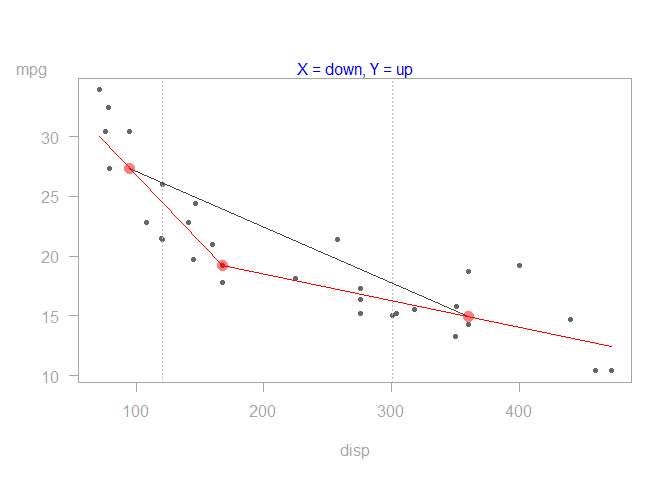

tukeyedar
=========

The `tukeyedar` package houses functions used in Exploratory Data Analysis (EDA). Most functions are inspired by work published by John Tukey, David Hoaglin and Frederick Mosteller (see references at the bottom of this document). Note that this package is in beta mode, so use at your own discretion. Many of the plots generated from these functions are not necessarily geared for publication but are designed to focus the viewer's attention on the patterns generated by the plots (hence the reason for light colored axes and missing axis labels for some of the plots ).

The functions available in this package include:

|        Function| Description                                                                           |
|---------------:|:--------------------------------------------------------------------------------------|
|     `eda_boxls`| Parallel boxplots with level and spread equalization                                  |
|     `eda_ltrim`| Trim lower values of a vector                                                         |
|     `eda_rtrim`| Trim upper values of a vector                                                         |
|  `eda_ltrim_df`| Trim lower records of a dataframe                                                     |
|  `eda_rtrim_df`| Trim upper records of a dataframe                                                     |
|        `eda_re`| Re-express using Tukey powers or Box-Cox transformation                               |
|      `eda_lsum`| Letter value summaries                                                                |
|        `eda_sl`| Spread-level funcion                                                                  |
|        `eda_lm`| Generate scatter plot along with regression line and LOESS curve                      |
|       `eda_3pt`| Generate 3-point summary of data and plot half-slopes                                 |
|    `eda_unipow`| Generate matrix of re-expressed univariate values based on ladder of powers           |
|     `eda_bipow`| Generate matrix of re-expressed bivariate values and plot 3-point summary half-slopes |
|     `eda_rline`| Fit a three-group resistant line to bivariate data                                    |

Installation
------------

This package can be installed from github (the installation process makes use of the `devtools` package).

``` r
devtools::install_github("mgimond/tukeyedar")
```

Read the vignettes!
-------------------

It's strongly recommended that you read the vignettes that come installed with the package.

You can access the vignettes from the github site:

-   [Introduction to the EDA functions](Introduction.html)
-   [Introduction to the resistant line function](RLine.html)

Using the functions
-------------------

All functions start with `eda_`. For example, to generate a three point summary plot of the `mpg` vs. `disp` from the `mtcars` dataset, type:

``` r
library(tukeyedar)
eda_3pt(mtcars, disp, mpg)
```


    #> $slope1
    #> [1] -0.1117241
    #> 
    #> $slope2
    #> [1] -0.0220894
    #> 
    #> $hsrtio
    #> [1] 0.1977137
    #> 
    #> $xmed
    #> [1]  95.1 167.6 360.0
    #> 
    #> $ymed
    #> [1] 27.30 19.20 14.95

Most functions are *pipe* friendly. For example,

``` r
library(dplyr)
#> 
#> Attaching package: 'dplyr'
#> The following objects are masked from 'package:stats':
#> 
#>     filter, lag
#> The following objects are masked from 'package:base':
#> 
#>     intersect, setdiff, setequal, union
mtcars %>% eda_3pt(disp,mpg)
```



    #> $slope1
    #> [1] -0.1117241
    #> 
    #> $slope2
    #> [1] -0.0220894
    #> 
    #> $hsrtio
    #> [1] 0.1977137
    #> 
    #> $xmed
    #> [1]  95.1 167.6 360.0
    #> 
    #> $ymed
    #> [1] 27.30 19.20 14.95
