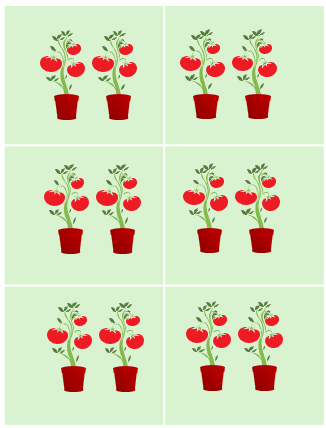
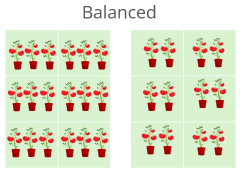
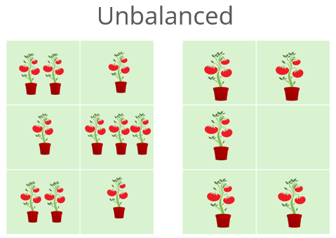

<style>

.input{
 background-color: #fcf6de;
}

.output {
  background-color: #FFF;
  border: 1px solid #BBB;
  font-size: 0.8em !important;
  line-height:1;
  color:#999;
}


</style>

```{r setup, include=FALSE}
knitr::opts_chunk$set(
  class.source = "input",
  class.output = "output"
)
```


```{r colored_table ,include=FALSE}
colored_table <- function(df, palette = "Greens", n_quantiles = 5,
                          digits = 2, border = "grey50", range = c(9.25,19),
                          nbrks = 20,
                          x_axis=FALSE, y_axis=FALSE, lab = FALSE) {
  
  # Convert to matrix
  mat <- as.matrix(df)
  
  # Flatten values and remove NA for quantiles
  vals <- as.numeric(mat)
  vals_no_na <- vals[!is.na(vals)]
  
  # Compute quantile breaks
  # breaks <- quantile(vals_no_na,
  #                    probs = seq(0, 1, length.out = n_quantiles + 1),
  #                    na.rm = TRUE)
  breaks <- seq(range[1],range[2], length.out=nbrks)
  
  # Ensure unique breaks (important if many duplicates)
  breaks <- unique(breaks)
  
  # Create color palette (requires grDevices, which is base)
  # cols <- colorRampPalette(
  #   c("#edf8e9", "#bae4b3", "#74c476", "#31a354", "#006d2c")
  # )(length(breaks) - 1)
  cols <- hcl.colors(nbrks -1 , "Greens", rev = TRUE)
  
  # Assign colors to each value
  bin_index <- cut(mat, breaks = breaks, include.lowest = TRUE, labels = FALSE)
  cell_cols <- matrix(cols[bin_index], nrow = nrow(mat))
  
  # Plot setup
  nr <- nrow(mat)
  nc <- ncol(mat)
  
  OP2 <- par(mar = c(3,5,1,1))
  plot(0, 0, type = "n",
       xlim = c(0, nc), ylim = c(0, nr),
       xaxt = "n", yaxt = "n", xlab = "", ylab = "",
       bty = "n")
  
  # Draw cells
  k = 1
  for (i in 1:nr) {
    for (j in 1:nc) {
      rect(j - 1, nr - i,
           j, nr - i + 1,
           col = cell_cols[i, j],
           border = border)
      
      # Add text
      
      if(identical(lab, FALSE)){
        txt <- ifelse(is.na(mat[i, j]), "", round(mat[i, j], digits))
        text(j - 0.5, nr - i + 0.5, labels = txt, cex = 0.8)
      } else {
        text(j - 0.5, nr - i + 0.5, labels = lab[k], cex = 0.8)
      }
      
    }
  k = k + 1
  }
  
  # Add row/column labels
  OP1 <- par(family = "mono")
   if(!identical(x_axis, FALSE))  axis(1, at = seq(0.5, nc - 0.5), labels = x_axis, 
                                       tick = FALSE, line = -1, cex.axis = 0.8)
   if(!identical(y_axis, FALSE))  axis(2, at = seq(nr - 0.5, 0.5, -1), labels = y_axis, 
                                       tick = FALSE, line = -1, las=1, cex.axis = 0.8)
  par(OP1)
par(OP2)
}


```

----------------

For many students, ANOVA (Analysis of Variance) is a black box. You put data in, turn the crank, and get a p-value out. But what is ANOVA actually doing? How does it see the world? This article will deconstruct   ANOVA, not with complex theory, but by building a simple experiment from the ground up. We will discover where the "effects" come from, demystify what an "interaction" really is, and learn how looking at residuals can tell us if our model is telling the whole story.

------------------

## PART 1: How ANOVA "Sees" Effects

### Building Our Example: From Baseline to Model

We'll start with a simple example where the response variable is tomato **Yield** in pounds. Let's assume that an experiment is conducted whereby **Nitrogen** (`N`) and **Phosphorous** (`P`)--two important plant nutrients--are used to fertilize plants at different levels of concentration. 

#### No fertilizer effect 

Let's start off with a scenario where we have six tomato plants that are not given fertilizer. 

{width=130px}

In such a scenario the tomato plants produce an average of around 10 lbs of tomatoes. We'll assume for now that there is no random variability in plant yield (i.e. each produces exactly 10 pounds of tomatoes).

```{r echo=TRUE, fig.height=2.1, fig.width = 2.5}
base <-rep(10,6)
df   <- data.frame(base, 
                   Plevel = rep(c("P(0.5)","P(1.5)","P(2.0)"),2), 
                   P      = rep(c(0.5,1.5,2),2),
                   Nlevel =  rep(c("N(1)","N(2)"),3), 
                   N      = rep(c(1,2),3))
df$yield <- df$base
```

The variable `yield` is the response variable. At this point, it's soley a function of the `base` yield value. 

```{r echo=FALSE, fig.height=2.1, fig.width = 2.5}
library(tukeyedar)
eda_matlong(df, yield, P, N, direction = "to_array") |>  colored_table()
```

Mathematically, we can express this as:

$$
Yield = \mu = 10
$$
Where $\mu$ is the mean yield value that we will refer to as the **global mean** (aka the **grand mean** or **global value**). 

This will be the baseline model. At this point, there are no `N` or `P` effects given that we did not incorporate them in the potted plants.

#### Add a Phosphorous effect

Next, we'll include our first effect: We'll add different Phosphorous concentrations (`P`) across rows so that each row of plants that are laid out in the matrix is assigned the same concentration. We'll add three different concentrations that we'll name `P0.5`, `P1.5` and `P2.0`. Each concentration increases tomato yield by 0.5, 1.5 and 2 pounds respectively. 

```{r fig.height=2.1, fig.width = 2.5}
df$yieldP <- df$base + df$P
```

We will refer to the simple formula we use to create our data the *generative model*.

This gives us the following model:

$$
Yield_{(P,\ N)} = 10 + 0.5(P0.5) + 1.5(P1.5) + 2(P2.0)
$$
Where the `P0.5`, `P1.5` and `P2.0` are binary values that take on a value of `0` or `1` depending on which Phosphorous treatment was applied to the potted plants.

This augments our tomato yield as follows:

```{r echo=FALSE, fig.height=2.1, fig.width = 2.5}
eda_matlong(df, yieldP, P, N, direction = "to_array") |>  colored_table(y_axis = paste0(unique(df$Plevel), "->"))
```

#### What an ANOVA gives us

An ANOVA analysis does not only perform a hypothesis test (outcome that results in a "p-value"). An ANOVA also provides us with the contribution each factor (aka category) makes to the response variable (tomato yield in this example). 

Using the base R environment, one may extract each factor's **effect** using the command:

```{r}
aov(yieldP ~ Plevel, df) |> model.tables()
```

This above approach makes use of least square method--a popular implementation of an ANOVA analysis. Note that `aov()` requires that the factors be passes as characters (or R factors) and not as the numeric `N` and `P` values  otherwise, R would have treated `P` and `N` as a single continuous variable and performed a linear
  regression

The `aov()` function is the standard, but for the rest of this article, we'll use a function from the `tukeyedar` package called `eda_mean_sweep()`. It calculates the exact same effects but does so adopting a *sweeping* routine.

```{r}
library(tukeyedar)
MP <- eda_mean_sweep(df, yieldP, P) 
MP$effects
```

You'll notice that the **effect** values for `Plevel` do not reflect the values used in our initial model. In other words, instead of seeing the modeled values of [`r df$P[1:3]`], we have effect values of [`r round(MP$effects$P, 3)`]. 

You will also note that the **global mean** value is not 10 but instead is,

```{r}
MP$global
```

This results in a model of the form:

$$
Yield = 11.334 -0.833(P0.5) + 0.167(P1.5) + 0.667(P2.0)
$$
This might look like a completely different model from the one used to construct the dataset, but it's just a different way of telling the same story. Let's calculate the yield for a plant given the `P1.5` treatment:

$$
Yield_{(P1.5)} = 11.334 -0.833(0) +0.167(1) + 0.667(0) = 11.5 
$$
It's the exact same yield we created with our simple model $10 + 1.5 = 11.5$. The models are different, but the result is identical.

 So why the different numbers? Because an analysis of variance doesn't try to find the original generative model that generated the data. Instead, it describes the dataset in terms of **deviations from an average**, telling us how much *better* or *worse* each factor (or treatment in our example) is compared to the overall mean of the experiment.

In our working example, the model states that the Phosphorous treatment of 1.5 units (`P1.5`) adds a yield of `0.167` above an overall yield of `11.334`. Likewise, it also states that a Phosphorous treatment of 0.5 units (`P0.5`) generates a yield that is `0.833` **less** than the overall mean in this experiment.

### A two-way analysis

#### A purely additive effect

So what happens when we add Nitrogen as a treatment to our tomato plants? One possible outcome is that the effect is solely additive meaning that the benefits afforded by each nutrient are added to one another. The previous model can be augmented as,

```{r}
df$yieldPN <- df$base + df$N + df$P
``` 

This yields the following mathematical mode:

$$
Yield_{(P,\ N)} = 10 + 0.5(P0.5) + 1.5(P1.5) + 2(P2.0) + 1(N1) + 2(N2)
$$ 
As with the Phosphorous factors, the Nitrogen factors take on a value of `0` or `1` depending on which column of tomatoes is assigned the treatment. 

```{r echo=FALSE, fig.height=2.1, fig.width = 2.5}
eda_matlong(df, yieldPN, P, N, direction = "to_array") |>  
  colored_table(x_axis = paste0(unique(df$Nlevel), "🡅"),
                y_axis = paste0(unique(df$Plevel), "->"))
```

Now that we've created a dataset with two independent, additive effects, let's see what the ANOVA "report" looks like. We'll run a two-way analysis of variance and look at the effects it extracts.

```{r class.source="input", class.output="output"}
MPN <- eda_mean_sweep(df, yieldPN, P, N)
MPN$global
MPN$effects
```

The output gives us a gloabl mean and the effects for both `Plevel` and `Nlevel.`

   * Global Mean: `r round(MPN$global, 3)` 
   * `Plevel` effects: `r round(MPN$effects$P, 3)` 
   * `Nlevel` effects: `r round(MPN$effects$N, 3)` 

This is the classic signature of an additive model. The term "additive" means the effect of one nutrient **doesn't change based on the level of the other**. The *bonus* from using Nitrogen is the same regardless of the Phosphorous treatment, and vice-versa. Because we created the data this way, the ANOVA model correctly shows two separate, independent sets of effects.


The ANOVA model can thus be expressed as:

$$
Yield_{(P,\ N)} = 12.83 - 0.833(P0.5) + 0.167(P1.5) + 0.667(P2.0) - 0.5(N1) + 0.5(N2)
$$ 

Here too, this is nothing more than a re-expression of the generative model used to create the data. To confirm this, we can compute the estimated tomato yield for a plant assigned a Phosphorous treatment of `P1.5` and a Nitrogen treatment of `N2.0`:

$$
Yield_{(P1.5,\ N2)} = 12.83 - 0.833(0) + 0.167(1) + 0.667(0) - 0.5(0) + 0.5(1) = 13.5
$$
This is the same yield generated from the base model.

The ANOVA output correctly suggests that the `P` treatment effect is greater than the `N` treatment effect meaning that the Phosphorous factor, as a whole, creates more variation in the yield than the Nitrogen factor does. This doesn't mean that every level of P is better than N, but that the choice of Phosphorous level has a bigger impact on the final outcome. 

Here's how we can tell from the effect values:
   * For Nitrogen, the effects are `-0.5` and `+0.5`. The "swing" from the worst
     level (N1) to the best level (N2) is `(+0.5) - (-0.5) = 1` pound of
     tomatoes.
   * For Phosphorous, the effects range from `-0.833` to `+0.667`. The "swing"
     from the worst level (P0.5) to the best level `(P2.0) is (+0.667) -
     (-0.833) = 1.5` pounds.

Because the total range of influence is bigger for Phosphorous (a 1.5 lb swing) than for Nitrogen (a 1.0 lb swing), the ANOVA correctly identifies that P is the more impactful factor in our experiment for explaining the variation in tomato yield.

Calculating the range of effects is one way to see which factor is more impactful. An even more direct way is to visualize the effects on a common scale using a **variability decomposition plot**.

```{r fig.height = 3.5, fig.width=4}
plot(MPN, show.resp = TRUE, label = TRUE)
``` 

This plot perfectly summarizes our analysis. Let's break it down:


   * On the far left, the **Response** boxplot shows the total spread of our final
     tomato yields (`yieldPN`), centered around the global mean. This represents
     the total variation we are trying to explain.
   * The next two sets of points show the effects for `Plevel` and `Nlevel.` Each
     dot represents the "nudge" (positive or negative) that a specific
     treatment level gives to the yield.

Most importantly, you can now see which factor is more powerful. The spread of the dots for Plevel is visibly wider than the spread for Nlevel. This is the graphical proof of what we calculated manually: the 1.5 lb swing from Phosphorous has a larger impact than the 1.0 lb swing from Nitrogen.

You will also notice a component on the plot labeled Residuals which is   empty (all values are zero). This is because the Residuals represent the "leftover" variation that our model **cannot explain**. Since we created a perfect, "textbook" dataset with no random variability, our additive model of P and N effects accounts for 100% of the variation in the yield. This leaves nothing behind. We can confirm this by extracting the residuals from the `MPN` model.

```{r}
MPN$residuals
```

Note that whenever you see a number ending in `e-15` or `e-16`, you can confidently treat it as the computer's way of saying "zero."
  
Later, when we introduce natural variability, this residuals component will be crucial for understanding our model's fit.


#### Adding an interactive effect

An interaction means the effect of one factor depends on the level of another. Let's create a classical ANOVA interaction. We'll model a synergistic effect where the combination of the highest levels of Nitrogen (N2) and Phosphorous (P3) gives a special boost to the yield that is more than the sum of its parts.

We'll create an explicit interaction term. It will be `0` for all combinations except for `N=2` and `P=2` where we'll add a boost of `2.5`.


```{r}
df$interaction <- ifelse(df$N == 2 & df$P == 2, 2.5, 0)
df$yieldPN2 <- df$base + df$N + df$P + + df$interaction
```

```{r echo=FALSE, fig.height=2.1, fig.width = 2.5}
eda_matlong(df, yieldPN2, P, N, direction = "to_array") |>  
  colored_table(x_axis = paste0(unique(df$Nlevel), "🡅"),
                y_axis = paste0(unique(df$Plevel), "->"))
```

Now, if we were to fit the additive model used earlier, we would not be able to fully capture the interactive effect.

```{r}
MPN2 <- eda_mean_sweep(df, yieldPN2, P, N)
MPN2$global
MPN2$effects
```

We have a model of the form,

$$
Yield_{(P,\ N)} = 13.25 - 1.25(P0.5) -0.25(P1.5) + 1.5(P2.0) - 0.92(N1) + 0.92(N2)
$$ 
If we use this additive model to reconstruct the tomato yield for the `P2.0:N2` treatment combination, we get the following yield

$$
Yield_{(P2.0,\ N2)} = 13.25 - 1.25(0) -0.25(0) + 1.5(1) - 0.92(0) + 0.92(1) = 15.67
$$
This computed yield is nearly one pound less than the expected yield of `r df$yieldPN2[6]`.

If an interaction between effects is suspected, then the interactive component needs to be added to the model. With the `eda_mean_sweep` function, we add the interactive component via the `max_order` component. We set this value to `2` indicating that we are seeking all two-way interactions.

```{r}
MPN3 <- eda_mean_sweep(df, yieldPN2, P, N, max_order = 2)
MPN3$effects
MPN3$global
```

Adding the interactive component (`max_order = 2`) creates a more complex model. It still has the main effects for P and N, but it adds a specific adjustment value for each unique P:N combination. These adjustments are the interaction effects, and they account for the synergy that the simple additive model missed. We now have a (correct) model which includes the global mean, the two main effects, and all six of the individual interaction adjustments:

$$
\begin{align}
{Yield_{(P,\ N)}} &=  13.25 - 1.25(P0.5) -0.25(P1.5) + 1.5(P2.0) - 0.92(N1) + 0.92(N2) \\
             &0.417(P0.5:N1) + 0.417(P1.5:N1) - 0.833(P2.0:N1) \\
             &- 0.417(P0.5:N2) - 0.417(P1.5:N2) + 0.833(P2.0:N2)
\end{align}
$$
Where the interactive factor levels (e.g. `(P0.5:N1)`) are binary values that take on a `1` if the response value is associated with that combination of effects.

Recall from our earlier discussion that the ANOVA does not seek to recreated the base model used to generate the data. As such, it's no surprise that non-zero values are associated with the interactive effects that were explicitly set to 0 in the base model.

Revisiting our example of the tomato yield for a treatment of `P2.0:N2`, we can now use the full model, which includes the main effects plus the specific interaction effect for that cell

$$
\begin{align}
{Yield_{(P,\ N)}} &=  13.25 - 1.25(0) -0.25(0) + 1.5(1) - 0.92(0) + 0.92(1) \\
             &0.417(0) + 0.417(0) - 0.833(0) \\
             &- 0.417(0) - 0.417(0) + 0.833(1) = 16.5
\end{align}
$$
This matches the `r df$yieldPN2[6]` lbs yield we originally generated. By including the interaction term, the model can now perfectly explain the data.

#### Residuals

So, what does this failure of the additive model (`MPN2`) look like visually? Let's look at the decomposition plot for the additive-only model that we fitted to our interactive data.

```{r fig.height = 3.5, fig.width=4}
plot(MPN2, show.resp=TRUE, label = TRUE)
```

This plot tells a clear story. Previously, when we analyzed a truly additive dataset, the **Residuals** component was empty. But look at it now! It has a very wide spread, with values ranging from about `-0.833` to `+0.833`.

This is the visual proof that our model is wrong. Those large residuals are   the *"synergy"* from the interaction that the simple additive model could not explain.  In statistics, we give this leftover, unexplained variation a formal name: the **Residual**, often symbolized by the Greek letter $\varepsilon$.  

As such, when fitting a model to data other than one created synthetically (as is the case here), you want to include a **Residuals** component, $\varepsilon$ to your model. Given that some of the yield data in `df$yieldPN2` was not captured by the `N` and `P` components, our earlier equation was not complete. Adding $\varepsilon$ completes the model.

$$
Yield_{(P,\ N)} = 13.25 - 1.25(P0.5) -0.25(P1.5) + 1.5(P2.0) - 0.92(N1) + 0.92(N2) +\varepsilon 
$$
When we tried reconstructing the yield (`df$yieldPN2`) for the `P2.0:N2` combination, we were short 0.833 lbs. That value was, in fact, the residual $\varepsilon$ for that specific observation.

By explicitly adding the interaction effect to our model, we give that *leftover* variation a proper home. The variation that was previously  unexplained and forced into the $\varepsilon$ term is now correctly captured   by the `P:N` interaction term.

```{r fig.height = 3.5, fig.width=5}
plot(MPN3, show.resp=TRUE, label = TRUE)
```

The P:N interaction term now appears in the plot, and it has captured all the variation that was previously "leaking" into the residuals. The *Residuals* component is now empty again (because we did not include unexplained variability in the base model), telling us that our full model perfectly explains the data we created.

## Part 2: Finding the Signal in the Noise

So far, we have explored a "perfect" world. By carefully building a model that matched our data's structure (including the interaction), we were able to explain 100% of the variation in our tomato yields, leaving us with zero residuals.

But real-world data is never this clean. Natural variation is everywhere: one tomato plant might be a bit stronger, the soil in one pot might hold slightly more water, or one corner of the greenhouse might get a little more sun. This "natural variability" introduces random noise that can obscure the true effects of our experiment.

An ANOVA does not just describe pristine datasets, it can also distinguish the signal of a true effect from the background noise of random chance. In this next section, we will leave our perfect world behind. We'll introduce this natural variability into our experiment and learn how ANOVA helps us separate what is important from what is merely random.

### Step 1: Understanding the Noise

Let's return to our baseline scenario: six tomato plants with no   fertilizer. This time, we'll introduce the natural variability we discussed by giving each plant a slightly different base yield.

```{r  echo=FALSE}
base <- c(9, 10, 11, 11, 10, 9)
df2   <- data.frame(base, 
                    Plevel = rep(c("P(0.5)","P(1.5)","P(2.0)"),2), 
                    P      = rep(c(0.5,1.5,2),2), 
                    Nlevel =  rep(c("N(1)","N(2)"),3), 
                    N      = rep(c(1,2),3))
```

If we layout the plants in a grid, we have the following yield distributions:

```{r echo=FALSE, fig.height=2.1, fig.width = 2.5}
df2$yield <- df2$base
eda_matlong(df2, yield, P, N, direction = "to_array") |>  
  colored_table()
```

Our current baseline model is thus,

$$
Yield = \mu + \varepsilon
$$
where $\mu$ is the global mean of `10` and $\varepsilon$ is the residual term (the `+1` and `-1` variability we added to some of the yield values).  Let's see what happens when we run an ANOVA on just this noise.

```{r}
MR <- eda_mean_sweep(df2, yield, P, N)
MR$global
MR$effects
MR$residuals
```

The output shows exactly what we designed it to: the main effects for `Plevel` and `Nlevel` are zero. All the variability we added has been isolated perfectly into the **Residuals**. This is because we intentionally created a "noise" vector that was perfectly balanced, or *orthogonal*, to our experimental design. This isn't just luck; it's a crucial design principle   that ensures our noise doesn't masquerade as a fake effect, a problem known as **confounding**

The variability decomposition plot shows this visually: there is variation
  in the Response and the Residuals, but no effects for P or N.

```{r fig.height = 3.5, fig.width=5}
plot(MR, show.resp = TRUE, label = TRUE)
```

### Step 2: Finding the Signal within the Noise

Now for the key step. Let's create our "realistic" additive dataset by adding the same `P` and `N` effects from *Part 1* on top of our noisy baseline.

```{r}
df2$yieldPN <- df2$base + df2$N + df2$P

```

```{r echo=FALSE, fig.height=2.1, fig.width = 2.5}
eda_matlong(df2, yieldPN, P, N, direction = "to_array") |>  
  colored_table(x_axis = paste0(unique(df2$Nlevel), "🡅"),
                y_axis = paste0(unique(df2$Plevel), "->"))
```

We now run our ANOVA on this complete, noisy dataset:

```{r}
MRPN <- eda_mean_sweep(df2, yieldPN, P, N)
MRPN$global
MRPN$effects
MRPN$residuals
```

Let's look at the decomposition plot:

```{r fig.height = 3.5, fig.width=5}
plot(MRPN, show.resp = TRUE, label = TRUE)
```

This plot reveals the true power of ANOVA. Look closely: 

  * The `Plevel` and `Nlevel` effects are identical to the ones we saw in the
  "perfect world" of Part 1. The noise did not distort the signal at all. 
  * The `Residuals` component is a perfect match for the noise we analyzed
  in Step 1. The residuals from our addtive model (`MRPN`) should numerically identical to the residuals from our noise-only model (`MR`). Let's check:
  
```{r}
all.equal(MR$residuals, MRPN$residuals)
```
The TRUE output confirms it. The signal and the noise have been perfectly separated.

ANOVA has perfectly decomposed our messy, "realistic", data back into its   original parts: *Signal* (`P` and `N` effects) and *Noise* (`Residuals`).

We can also compare the magnitude of the signal to the noise using the   *"swing"* concept. The swing of the Phosphorous effect is `1.5` lbs and Nitrogen is `1.0` lbs, while the swing of the Residuals is `1 - (-1) = 2.0` lbs. In this  particular experiment, the random noise we added is actually the single largest source of variation in our data!

We've now seen that even with random noise, a well-designed experiment   allows ANOVA to cleanly recover the true, underlying effects. The key was that the variation was separated into either a main effect or the residuals. But what happens if the model is wrong? What if an interaction effect is also hiding in the data, mixed in with the noise? This is where the visual analysis of residuals—the field of diagnostic plotting—becomes our most important tool.

### Step 3: Finding a Hidden Interaction in the Noise

We've achieved our goal: separating the clean signals of our main effects from the random background noise. But we were successful because our model   (`P` + `N`) was a perfect description of the real effects in the data. 

What happens in a more realistic and challenging scenario where an   important effect is hiding in our data that we don't know about? Let's repeat the synergistic effect from Part 1, but this time, we'll add it to our *noisy* dataset. The interaction effect is now a "hidden signal" mixed in  with the random noise. Can ANOVA still find it?
  
#### Creating the interactive noisy data  

Let's create our new dataset, `yieldPNI`,  by adding the same 2.5 lb boost to the `P2.0:N2` combination on top of our noisy additive data (`yieldPN`).

```{r}
df2$interaction <- ifelse(df2$N == 2 & df2$P == 2, 2.5, 0)
df2$yieldPNI <- df2$yieldPN + df2$interaction
```

```{r echo=FALSE, fig.height=2.1, fig.width = 2.5}
eda_matlong(df2, yieldPNI, P, N, direction = "to_array") |>
   colored_table(x_axis = paste0(unique(df2$Nlevel), "🡅"),
                 y_axis = paste0(unique(df2$Plevel), "->"))
```

#### The Diagnostic Clue: What the Wrong Model Tells Us

Imagine we are analyzing this data for the first time and we don't know about the interaction. Our first logical step is to fit the simple additive  model just as we did in Step 2.

```{r fig.height = 3.5, fig.width=5}
MRPN2 <- eda_mean_sweep(df2, yieldPNI, P, N)
plot(MRPN2, show.resp = TRUE, label = TRUE)
```

The variability decomposition plot is great for showing us how much variation each component explains, but it is not an effective tool for diagnosing a hidden interaction.

To find the real clue, we need a more specialized tool: the diagnostic plot.

```{r fig.height = 3.5, fig.width=5}
plot(MRPN2, plot = "diagnostic")
```

This plot is specifically designed to hunt for hidden multiplicative interactions. It graphs the **Residuals** from our additive model against a set of **Comparison Value** calculated from the main effects. If the points were to form a random, unstructured cloud around the horizontal line, it would suggest our additive model is sufficient.

But here, we see a clear (downward) sloping trend. This non-random pattern is evidence that our simple additive model is may not be appropriate and that a hidden interaction effect is at play.
 
#### The Final Decomposition: Fitting the Complete Model

The sloping pattern in the diagnostic plot told us that a simple additive model was not enough and that a hidden interaction was likely at play. Now, we can act on that clue and fit the correct, complete model, including the two-way interaction term. 

```{r fig.height = 3.5, fig.width=5}
MRPNI <- eda_mean_sweep(df2, yieldPNI, P, N, max_order = 2)
plot(MRPNI, show.resp = TRUE, label = TRUE)
```

All four of our original components have been successfully identified and separated: The `P` effect, The `N` effect, The `P:N` interaction effect, and the `Residuals` (our original random noise).

But Wait... Where Did the Residuals Go? 

You might notice something surprising and confusing in the plot above. While the `P:N` interaction has appeared, the `Residuals` (our original random noise) are all zero!

This is not a mistake. This gets to the heart of what ANOVA models do. Think of it this way:

Our experiment has 6 unique cells (P0.5/N1, P0.5/N2, etc.), and we have exactly one data point (tomato plant) in each slot. A full interactive model is incredibly flexible; it creates a parameter not just for each row (P) and each column (N), but also a unique adjustment parameter for every single cell (the P:N interaction).

We have 6 data points and the model has created just enough parameters to perfectly describe those **6 unique slots**. It can now assign a value to each slot to perfectly match the data, **leaving nothing left over**. The model has become so flexible that it has "absorbed" all the remaining variation into
  the most complex term it has: the interaction.
  
This reveals a critical lesson. In a saturated model with only one observation per cell, while the final predicted yield for each cell is perfectly accurate, the individual effect values can be misleading. Here's what's really happening:

 1.  As we saw when we fit the wrong additive model, the presence of the interaction slightly distorted the main effects for `P` and `N`. 
 2.  In this final (complete) model, the `P:N` interaction term has absorbed all the leftover variation: the "true" synergy effect, the original random noise, and the small adjustments needed to account for the distorted main effects.

Therefore, you cannot distinguish the true interaction from the random noise. The calculated P:N effect is a combination of all three components. To be able to truly separate these, we would need more data—specifically, multiple plants (replicates) for each treatment combination.

## The Final Piece: Using Replicates to Separate Interaction from Noise

We've seen that with only one observation per treatment combination, a full interactive model becomes "saturated," and it can no longer distinguish the true interaction effect from random noise.

So how do we solve this? The answer lies in good experimental design: **replication**.

In a real experiment, we would never have just one plant for each treatment. We would have multiple plants, or **replicates**, for every combination of P and N. 

Let's simulate this by creating a new dataset where we have two plants for each of our 6 treatment cells, for a total of 12 plants. 

{width=130px}

We will give each of these 12 plants its own unique "noise" value (ecnompassed in the `base` value).


```{r}
base  <- c(9.5, 9.5, 11.5, 10.5, 10.5, 9.5, 8.5, 10.5, 10.5, 11.5, 9.5, 8.5)
df3   <- data.frame(base, 
                    Plevel = rep(c("P(0.5)","P(1.5)","P(2.0)"),4), 
                    P      = rep(c(0.5,1.5,2),2), 
                    Nlevel = rep(c("N(1)","N(2)"),6), 
                    N      = rep(c(1,2),3))
df3$interaction <- ifelse(df3$N == 2 & df3$P == 2, 2.5, 0)
df3$yield <- df3$base + df3$N + df3$P + df3$interaction
```

```{r echo=FALSE, fig.height=2.1, fig.width = 2.5}
df3b <- aggregate(yield ~ Plevel + Nlevel , data = df3,
           FUN = function(x) paste(x, collapse = ","))

df3b$mean <- sapply(strsplit(df3b$yield, ","), function(x) {mean(as.numeric(x))}) 

eda_matlong(df3b, mean, Plevel, Nlevel, direction = "to_array") |>  
  colored_table(lab = df3b$yield,
                x_axis = paste0(unique(df$Nlevel), "🡅"),
                y_axis = paste0(unique(df$Plevel), "->"))

```


Now, let's fit the full interactive model (max_order = 2) to this new, replicated dataset and look at the final decomposition plot.

```{r fig.height = 3.5, fig.width=5.4}
MRPNR <- eda_mean_sweep(df3, yield, P, N, max_order = 2)
plot(MRPNR, show.resp=TRUE, label = TRUE)
```

Because we added replicates, our model is no longer saturated. We gave it more than enough information to do its job properly. Notice that we now have both a `P:N` interaction component and a non-zero `Residuals` component.

## Beyond Our Example: A Note on Data and Design
 
Throughout this article, we have used a single, clean "experimental" dataset that we built ourselves. However, ANOVA is a flexible tool used in many different situations. It's helpful to understand a few key terms that describe the structure of data, as they determine what you can learn from your model.

### Observational vs. Experimental Data

The data we created mimics experimental data, where we, the researchers, control the factors and assign treatments to subjects (our plants).

Much of the data in the world is **observational**. For example, if you analyze house prices using the factors "Neighborhood" and "Number of Bedrooms," you are not assigning houses to neighborhoods; you are simply observing the data that already exists. This data is often messy and doesn't fit the clean structures we discuss next.

### Balanced vs. Unbalanced Designs

Our tomato experiment was a **balanced** design. This means we had an equal number of observations (plants) for every combination of our factor levels. We had exactly one plant, and later two plants, for every `P:N` cell. This is the ideal scenario.

{width=230px}

An **unbalanced** design occurs when the number of observations is unequal across the cells. Imagine if some of our tomato plants had died. We might have two observations for some cells, but only one or zero for others. While ANOVA can handle this, the interpretation of the effects becomes much more complex because the influences of the factors are no longer cleanly separated.


{width=230px}

### Replicated vs. Unreplicated Designs

An **unreplicated** design has exactly **one observation** for each combination of factor levels. Our models in Part 1 were *unreplicated.* As we saw, this makes it impossible to separate the highest-order interaction from random error in a noisy dataset.

A **replicated** design has **more than one observation** for each cell. Adding replicates was what finally allowed our model to estimate the `P:N` interaction *and* the random error (Residuals) as two separate components. 

### Two-Way vs. N-Way ANOVA

Our example used two factors (P and N), making it a two-way ANOVA. This principle can be easily extended. An analysis with three factors is a three-way ANOVA, and so on. We often refer to any analysis with two or more factors as an n-way ANOVA or factorial ANOVA.

 As you add more factors, the complexity of the potential interactions grows rapidly. A three-way ANOVA can have three main effects (A, B, C), three two-way interactions (A:B, A:C, B:C), and even a three-way interaction (A:B:C). The principles of decomposition, additivity, and diagnostics that we explored here become even more critical as the models grow in complexity.

---------------------

## Additional Resources

If you'd like to continue exploring the concepts covered in this article, here are a few recommended resources:

* For a *robust alternative* of a traditional ANOVA, see the [median polish article](polish.html) and its accompanying function `eda_pol()`. For an n-way version of the median polish, see the function `eda_npol()`.

* For a presentation of a traditional ANOVA and its hypothesis testing side of the statistic, see [this article](https://mgimond.github.io/Stats-in-R/ANOVA.html).

