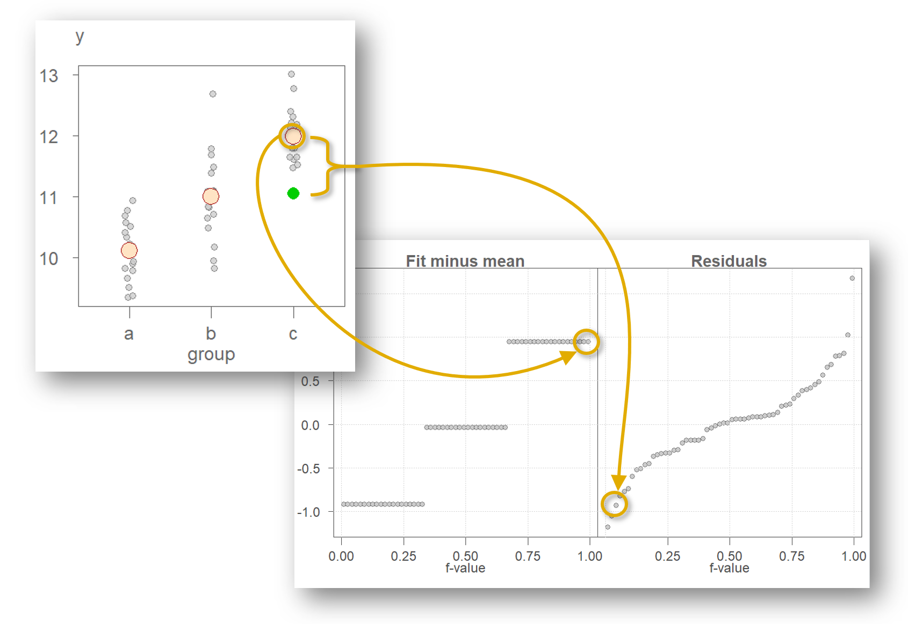

```{r setup, include = FALSE}
knitr::opts_chunk$set(
  collapse = TRUE,
  comment = "#> ",
  message = FALSE,
  tidy = FALSE,
  cache = FALSE,
  warning = FALSE,
  encoding = "UTF-8"
)
```

```{r include=FALSE}
knitr::opts_chunk$set(echo = TRUE, dev.args=list(pointsize=10))
```

```{css echo = FALSE}
.caption {
    text-align: center !important;
    color: darkgrey;
    font-style: italic;
}
.figcaption {
    text-align: center !important;
    color: darkgrey;
    font-style: italic;
}
```

# Introduction

The *residual-fit spread plot* (rfs plot) is a plot first introduced by William Cleveland designed to compare the variability explained by a fitted model (such as group means for a univariate analysis or a linear model for a bivariate analysis) to the variability in the remaining residuals. It's constructed as follows:

-   A model is fitted to the data. This can be the fitted mean values for multiple groups in a univariate analysis, or a fitted regression line in a bivariate analysis.
-   The residuals are computed by subtracting the fitted values from the original values.
-   The estimated values from the model are centered on zero by subtracting, for example, the mean from the fitted values.
-   Side-by-side quantile plots are generated from both sets of values.

As such, an important assumption when creating an rfs plot is the shared shape of the residual distribution across groups or all ranges of an independent variable.

Let's start with a simple batch of values, $y$.

```{r fig.height=2.8, fig.width=2.4, echo = FALSE, fig.cap="Figure 1. A batch of 60 values with the mean value represented as a red point. The points are jittered about the x-axis to help visualize their distribution.", fig.align="center"}
library(tukeyedar)

set.seed(9591)
df <- data.frame(y = rnorm(60, mean = c(10,11, 12), sd = 0.5), 
                 groups = rep(c("a","b","c"), times = 20))

eda_jitter(df, y, show.par = FALSE)
```

An overarching objective in data analysis is to reduce data to some summary that best characterizes the set of values. In this example, we can use the batch's mean value of `r round(mean(df$y),2)` (red point in figure 1) as an estimate of a typical value for $y$. This is a good first approximation as to what to expect as a "typical" value for $y$. But, not all values in $y$ are exactly equal `r round(mean(df$y),2)`. There is some variability around this estimate. The variability ranges from `r round(range(df$y),0)[1]` to `r round(range(df$y),0)[2]` for an overall range of about `r round(diff(range(df$y)))` $y$ units. This uncertainty about the fitted mean value is often characterized as the **residuals**--the difference between the actual value and the fitted value.

If we want to improve our estimation of a value in $y$ (i.e. to reduce the uncertainty in our estimation of $y$), we may want to add a grouping variable to the dataset. In essence, we are adding another *handle* to the data in the hopes of chipping away at the uncertainty that accompanies the estimate. Figure 2 shows the groups each value in $y$ belongs to.

```{r fig.height=3, fig.width=2.3, echo = FALSE, fig.cap="Figure 2. Same batch of values split across three groups with each group's mean displayed as an orange point.", fig.align="center"}

eda_jitter(df, y, groups, show.par = FALSE)
```

Knowing what group an observation belongs to can generate one of three completely different estimates of $y$ that range from about 10 to 12 units. This reduces the uncertainty in our estimation of $y$ by about 2 units, which is an improvement over our earlier model that generated just one estimate for all observations. The range in residual values about each fitted mean seems to have also diminished. Ideally, we want the uncertainty surrounding the fitted means to be as small as possible relative to the range of fitted means. However, the jitter plot in Figure 2 is not very effective in comparing both spreads. A better plot is one that limits the emphasis on the comparison between spreads in fitted values and their residuals. Such a plot does away with the absolute values of the fitted means and their residuals, instead, it centers both spreads around $0$. Another characteristic of an ideal plot is to help quantify the relative difference in spreads between the fitted values and the residuals. A good candidate for such a plot is a side-by-side quantile plot of fitted values centered (roughly) around zero on the left and the residual values centered on their respective group fitted values. This gives us the rfs plot shown in Figure 3.

```{r fig.height=3.5, fig.width=5, echo = FALSE, fig.cap="Figure 3. A residual-fit spread plot. Each observation is split between a quantile plot of fitted value minus group mean (left plot) and a quantile plot of residuals (right plot). The x-axis displays the fraction of values (f-value) in each plot that are at or below the matching value on the y-axis.", fig.align="center", results='hide'}
eda_rfs(df, y, groups, show.par = FALSE)
```

What looks to be three horizontal lines on the left plot in Figure 3 are simply overlapping points--one point for each observation. Since an observation in $y$ falls into one of the three groups (`a`, `b` or `c`), many values in $y$ will share the same fitted (mean) value. For example, the last observation in the original dataset has a value of `11.05` and is part of group `c`. Its value can be decomposed into its group mean of `11.98` and its residual of `-0.93` as follows:

$$
11.05 = 11.98 - 0.93
$$ 

This value is shown as a green point in Figure 4. Note that the overall mean of `r round(mean(df$y),2)` is removed from the fitted value of 11.98 giving us a rescaled fitted value of `r round(11.98 - mean(df$y),2)`. The same process is applied to all other observations resulting in the same number of points in both quantile plots as total number of observations in the original dataset.

```{r echo = FALSE, eval = FALSE}
# Plot generated for graphic embedded in figure 4
eda_jitter(df, y, groups, show.par = FALSE)
points(x=3, y=11.05, cex=1.5, col = "green3", pch=16)
```




<cr/>

The rfs plot facilitates the comparison of both spreads by sharing the same y axis and by having both spreads centered on 0. In this working example, the spreads are about identical suggesting that the grouping variable $groups$ can help explain some of the variability in the data.

To help develop an intuitive feel for the interpretation of the rfs plot, we can explore two extreme scenarios. In this first scenario, we assign groups to the values in $y$ in such a way as to maximize the separation in each group (see Figure 5).

<center>

```{r fig.height=2.8, fig.width=2.4, echo = FALSE, fig.cap="Figure 5. An example of a dataset that exhibits a clear separation in grouped values of y.", fig.align="center"}
df2 <- eda_trim_df(df, y, prop = 0) # Sort the data
df2$groups <- rep(c("a","b","c"), each = nrow(df2) / 3 )

eda_jitter(df2, y, groups, show.par = FALSE)
```

</center>

Figure 6 shows the matching rfs plot. Here, the spread in fitted values is greater than the spread in residuals defined by its minimum and maximum values. If we ignore the extreme values and focus solely on the inner 95% of the residuals, we see that the uncertainty is reduced to just about 1 unit in $y$ or half the spread defined by the fitted values.

```{r fig.height=3.5, fig.width=5, echo = FALSE, fig.cap="Figure 6. The spread in the fitted mean values spans 2 units along the y-axis. The residuals span about 1 unit when ignoring the extreme values suggesting that the grouping variable does a good job in improving our estimation of y.", fig.align="center", results='hide'}
eda_rfs(df2, y, groups, show.par = FALSE)
```

In this next example, we look at the other extreme: one where the spread in fitted means is small relative to the uncertainty surrounding each fitted value. The original $y$ batch of values is used while re-assigning the grouping variables in such a way so as to minimize the importance of the grouping variable in estimating $y$ (See Figure 7).

```{r fig.height=2.8, fig.width=2.4, echo = FALSE, fig.cap="Figure 7. An example of a dataset that does not exhibit a clear separation in grouped values of y.", fig.align="center"}
set.seed(423)
df2$y <- sample(df$y, replace = FALSE)

eda_jitter(df2, y, groups, show.par = FALSE)

```

The matching rfs plot is shown in Figure 8.

```{r fig.height=3.5, fig.width=5, echo = FALSE, fig.cap="Figure 8. The spread in the fitted mean values spans just 1/3 of a unit while the residuals span about 3 units when ignoring the extreme values suggesting that the grouping variable does not improve on our estimation of y.", fig.align="center", results='hide'}
eda_rfs(df2, y, groups, show.par = FALSE)
```

With this last dataset, the spread in residuals is quite important relative to the spread in fitted values. This suggests that the grouping variable does not improve in our estimation of $y$. Its effect in estimating $y$ is small.

## Generating an rfs plot with eda_rfs

The first dataset offered in the introduction can be recreated as follows:

```{r}
set.seed(9591)
df <- data.frame(y = rnorm(60, mean = c(10,11, 12), sd = 0.5), 
                 groups = rep(c("a","b","c"), times = 20))
```

To generate an rfs plot, type:


```{r fig.height=3.5, fig.width=5, fig.cap="Figure 9. An rfs plot generated using the eda_rfs() function.", fig.align="center"}
library(tukeyedar)

eda_rfs(df, y, groups)
``` 


In addition to generating a plot, the function will also output information about the spreads in the console. It compares the spread in the mid 90% of residuals to the range of fitted values. 

The plot and the console output indicate that mid 90% of the residuals fall between -0.75 and +0.75, roughly. This encompasses a spread close to 1.5 units. This is about half the spread covered by the fitted values.

The reason the mid 90% of values is chosen is to prevent outliers or extreme values in the residuals from disproportionately exaggerating the spread in residuals. For example, you'll note an extreme outlier of a little more than 1.5 units which is clearly not representative of the bulk of the residuals.

A shaded region highlighting the inner 90% of residuals can be added to the plot by setting `q = TRUE`.

```{r fig.height=3.5, fig.width=5, fig.cap="Figure 10. An rfs plot generated using the eda_rfs() function with the inner 90%  region displayed as a grey vertical block in the residuals quantile plot. The horizontal grey region shows the matching values on the y-axis.", fig.align="center", results='hide'}
eda_rfs(df, y, groups, q = TRUE)
```

You can change what constitutes the mid portion of the residuals by assigning a fraction ranging from 0 to 1 to the `inner` argument. For example, if 95% of the inner residual spread is to be compared to the spread in fitted values, set `inner = 0.95` as shown in the following example.

```{r fig.height=3.5, fig.width=5, fig.cap="Figure 11. An rfs plot generated using the eda_rfs() function with the inner 95% region displayed as a grey vertical region in the Residuals quantile plot. The horizontal grey region shows the matching values on the y-axis.", fig.align="center", echo = FALSE}
eda_rfs(df, y, groups, q = TRUE)
```

Adding the grouping variable improves our estimation of $y$ by reducing the uncertainty around our estimate. Had we not split the data into groups and stuck with one overall mean value, we would have ended up with a larger residual spread as shown in Figure 12.

```{r fig.height=3.5, fig.width=5, fig.cap="Figure 12. An rfs plot of the data as it was presented to us before the data values were split into groups. The single fitted estimate is the overall mean.", fig.align="center", echo = FALSE}
df$all <- "all"
eda_rfs(df, y, all, q = TRUE) 
```

In the above code, we added a new column with a unique grouping value, `"all"`, shared across all $y$ values. This results in a single "group" for the rfs spread plot. 90% of the inner residual spread covers a range of 2.76 units--quite a bit more than the spread in residuals observed when we added the grouping variable to the mix.

## eda_rfs() options

You've already been introduced to the `q` and `inner` arguments which allows you to set and visualize the inner range of the residual spread rfs plot and in the console.

Another `eda_rfs` option modifies the summary statistic used with univariate data. By default, the function computes the mean value for each group in the data. Instead, you can have the software compute the median by setting `stat = median`. This can be a useful option when working with skewed datasets. For example, the $hp$ variable in the built-in $mtcars$ dataset has a right skew. The higher values will have a disproportionate influence on the mean value as shown in Figure 13.

```{r fig.height=3.5, fig.width=5, fig.cap="Figure 13. An rfs plot of horsepower values in the mtcars dataset conditioned on transmission type (am variable in the dataset). Here, the mean statistic (default) is used to compute the central values.", fig.align="center",}
eda_rfs(mtcars, hp, am, q = TRUE)
```

Adopting the median will minimize the influence the extremes $hp$ value will have in fitting the central values to each $am$ group as shown in Figure 14.


```{r fig.height=3.5, fig.width=5, fig.cap="Figure 14. An rfs plot of horsepower values in the mtcars dataset conditioned on transmission type (am variable in the dataset). Here, the optional median statistic is used to compute the central values.", fig.align="center",}
eda_rfs(mtcars, hp, am, stat = median, q = TRUE)
```

> It's important to remember that the use of an rfs plot only makes sense when the residuals across all groups share the same distribution. This is a common assumption with many popular parametric statistical procedures.

If skew is of concern in a univariate dataset, the function allows for the transformation of a variable for a univariate dataset. For example, to render the `hp` dataset more symmetrical, we can apply a log transformation via the argument `p = 0` as shown in Figure 15.

```{r fig.height=3.5, fig.width=5, fig.cap="Figure 15. An rfs plot of log transformed horsepower values in the mtcars dataset conditioned on transmission type (am variable in the dataset). Results are reported in the transformed variable units.", fig.align="center",}
eda_rfs(mtcars, hp, am,  q = TRUE, p = 0)
```

The power transformation used with the data is displayed in the upper right-hand side of the residual quantile plot. To hide the parameter from the plot, set `show.par = FALSE`.

## Rfs plots for bivariate analysis

The rfs plot can be used with bivariate data to evaluate the effect a fitted model such as a regression line may have in explaining the variability in the data.

As is the case with univariate analysis, we are seeking an estimate of a variable $y$ in such a way as to minimize the uncertainty surrounding that estimate. For example, if we want to estimate the miles-per-gallon consumed by a vehicle from the `mtcars` built-in dataset, we could start with the simplest estimate--that being the mean.

```{r fig.height=3.5, fig.width=2.8, echo = FALSE, fig.cap="Figure 16. A jitter plot of 32 miles-per-gallon measurements from the mtcars dataset. The mean value is fitted to the data giving us a first estimate of the variable.", fig.align="center"}
eda_jitter(mtcars, mpg, show.par = FALSE)
```

There is, as expected, some variability that covers a range of about `r round(diff(range(mtcars$mpg)))` miles-per-gallon.

We can improve on this estimate by adding another handle to the data. But, instead of adding a categorical variable as was proposed in the first example of this tutorial, we can add another continuous variable to help us improve on this estimate. For example, we can see if a vehicle's horsepower can help us home in on a more precise estimate of miles-per-gallon. Figure 17 gives us a scatter plot of miles-per-gallon vs horsepower.

<center>
```{r fig.height=3.5, fig.width=2.8, echo = FALSE, fig.cap="Figure 17. A scatter plot of miles-per gallon (mpg) vs. horsepower (hp).", fig.align="center", results='hide', fig.align="center",R.options}
eda_lm(mtcars, hp, mpg, reg = FALSE, sd=FALSE,mean.l = FALSE, show.par = FALSE)
```
</center>

The pattern in the scatter plot suggests that `mpg` decreases as a function of increasing `hp`. 

We could split the data into sub-groups of `hp` values and compute separate means as was done with the univariate example or, we could fit a linear model to the data whereby the fitted line would provide us with a unique estimate of `mpg` for any unique value of `hp`. A common model fitting strategy is the least-squares regression technique (see Figure 18).

```{r fig.height=3.5, fig.width=2.8, echo = FALSE, fig.cap="Figure 18. A scatter plot of miles-per-gallon (mpg) vs. horsepower (hp) with a fitted linear model. The vertical grey dashed lines highlight the error in the estimated values.", fig.align="center", results='hide'}
M1 <- lm(mpg ~ hp, mtcars)
eda_lm(mtcars, hp, mpg, sd=FALSE,mean.l = FALSE, show.par = FALSE)
error_segs <- lapply(1:nrow(mtcars),
       FUN = \(i) data.frame(x = mtcars$hp[i], y = c(predict(M1)[i], mtcars$mpg[i]),
                             row.names = NULL))
OP2 <- par(mar = c(0,0,0,0))
  lapply(error_segs, \(x) lines(x, col = "grey", lty = 2))
par(OP2)
```

The estimate for `mpg` is *conditioned* on the value of `hp`. The estimate (extracted from the red line in the plot) ranges from about 7 miles-per-gallon to about 26 miles-per-gallon. An rfs plot can help us assess how much of the variability in `mpg` can be explained by this newly fitted model and how it compares to the residuals (Figure 19).

```{r fig.height=3.5, fig.width=5, echo = FALSE, fig.cap="Figure 19. An rfs plot of the bivariate model whereby the fitted values are plotted on the left quantile plot and the residuals are plotted on the right quantile plot.", fig.align="center", results='hide'}
eda_rfs(M1)
```

The fit-minus-mean plot looks different from a univariate rfs plot, but its interpretation is the same. Each point in the left quantile plot is the estimated `mpg` value (minus the overall mean) from the fitted linear model. The points in the residuals quantile plot represent the deviation, or error, in the estimated value from that of each observation. For example, the estimated `mpg` value for the largest `hp` value of `335` is `7.24` and the residual is `+7.75` `hp` units.

```{r echo = FALSE, eval=FALSE}
# Plot used in generating outside graphic used in embedded image
eda_lm(mtcars, hp, mpg, show.par = FALSE, sd = FALSE, lm.col = rgb(1,0,0,0.1))

M11 <- lm(mpg ~ hp, mtcars)
error_segs <- lapply(1:nrow(mtcars),
       FUN = \(i) data.frame(x = mtcars$hp[i], y = c(predict(M11)[i], mtcars$mpg[i]),
                             row.names = NULL))
OP2 <- par(mar = c(0,0,0,0))
  lapply(error_segs, \(x) lines(x, col = "grey", lty = 2))
  points(x = mtcars$hp, y = predict(M11), pch = 16, col = "darkred")
par(OP2)
```
 
 

<cr/>  
  
We can see that the spread in the fitted model and the residuals is comparable with the fitted model explaining a bit more of the variability than the residuals when focusing on the full range of residual values.

### Using eda_rfs() with a regression model

You must first create a model using either the built-in `lm()` function or this package's `eda_lm` or `eda_rline` functions. For example, to evaluate the effect a linear model has in estimating the miles per gallon (`mpg`) from a vehicle's horsepower (`hp`), we first define the model, then pass that model to the `eda_rfs` function. Here, we'll use the package's `eda_lm` function.

```{r fig.height=3.5, fig.width=5, fig.cap="Figure 21. A scatter plot of miles-per-gallon vs horsepower from the built-in mtcars dataset. A linear model is fitted to the data.", results="hide", fig.align='center'}
M1 <- eda_lm(mtcars, hp, mpg)
```

The resulting rfs plot is shown in Figure 22.

```{r fig.height=3.5, fig.width=5, fig.cap="Figure 22. A scatter plot of miles-per-gallon vs horsepower from the built-in mtcars dataset. A linear model is fitted to the data.", fig.align='center'}
eda_rfs(M1, q = TRUE)
```

## Reference

Cleveland, William S. (1993) *Visualizing Data*. Hobart Press.
